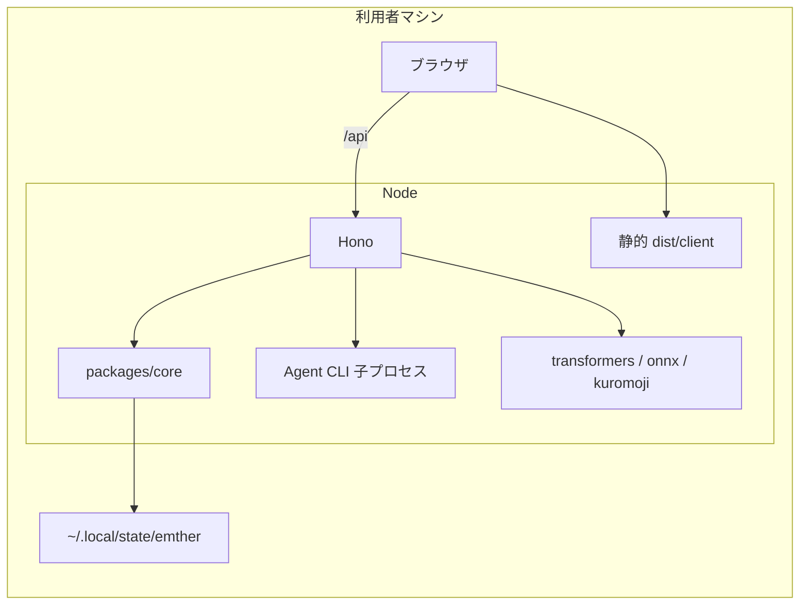

# Emther 第2世代アーキテクチャ方針

作成日: 2026-09-19  
関連文書: `docs/packaging.md` / `docs/4th_pivot/pivot.md` / `docs/2nd_architecture/`（移行の詳細計画・進捗）

> **移行完了（2026-09-20）**: 本ドキュメントが検討した第2世代案（`packages/core` + `apps/server`（Hono） + `apps/web`（Vite + React））への移行はフェーズ5まで完了し、旧 Next.js 実装（`web/`）は削除済み。現在の実装は本ドキュメント3節の推奨スタックそのものである。1〜3節・5〜6節は**採用時点の検討記録**として、4・7節は**移行前後の対応表**として当時のまま残す（詳細な移行経緯・各フェーズの実機検証は `docs/2nd_architecture/plan.md`・`checklist.md` を参照）。

本ドキュメントは、**同じ製品像（ローカル常駐・単一ユーザー・機微データはホスト外に出さない）をゼロから作るならどう選ぶか**を整理したものである。新機能の置き場所や将来の大規模リファクタの判断材料として使う。

---

## 1. 背景

Emther は次のような製品制約を持つ（詳細は `docs/packaging.md`）。

| 制約 | 技術への含意 |
| --- | --- |
| 個人の EM 向けツール。既定は `127.0.0.1` 常駐 | 公開 SEO・マルチテナント認証は主戦場ではない |
| 業務データは `~/.local/state/emther`（リポジトリ外） | バックエンドは「利用者マシン上の 1 プロセス」が自然 |
| Agent CLI・ローカル ML（要約・マスク等） | Node ネイティブ依存をサーバー側で扱う必要がある |
| tarball + `emther start` で配布 | ビルド成果物の内容が読みやすい方が運用しやすい |

現行 `web/` は **Next.js 16（App Router）** で、画面の多くが `"use client"`、データは **`fetch("/api/...")` + 自前ポーリング**（`web/src/lib/hooks.ts`）、永続化とドメインは **`web/src/lib/*`**、HTTP は **`web/src/app/api/**`** に分散している。Server Actions は使っていない。RSC が効くのはヘルプ・リダイレクト・ID 解決などごく一部。

この形は実質 **「SPA + 同一オリジンの Route Handler API」** に近い。フレームワークが提供する App Router / RSC / キャッシュ戦略の恩恵を、プロダクト要件の大部分では使っていない。外部の整理（例: [そのプロジェクト、本当に Next.js 必要？](https://ashunar0.dev/posts/does-your-project-need-nextjs/)）と整合する。

**結論（方針レベル）:** 新規同等製品なら Next.js は第一候補にしない。**Vite + React（SPA）+ Hono（API）+ フレームワーク非依存の `core` 層** を推奨する。

---

## 2. 設計原則

1. **ドメインを HTTP フレームワークから切り離す**  
   journal / agents / knowledge / persistence は `packages/core`（または `src/core`）に置き、Hono は薄いアダプタに留める。

2. **サーバー状態は UI フレームワークの convention に頼らない**  
   ポーリング・再取得・mutation 後の整合は TanStack Query 等の明示的な層に寄せる（現行の `usePolling` 群の標準化）。

3. **SSR / RSC は採用しない（除非必要）**  
   初期表示 SEO・公開ページ量産・ページ単位のサーバーデータ合成が要件になったときだけ再検討する。Emther の主導線は満たさない。

4. **配布は 1 Node プロセス + 静的 UI**  
   本番は Hono が `dist/client` を配信し、`/api/*` を同じプロセスで処理する。Vercel / Edge 前提の機能は選定に入れない。

5. **現行の永続化・セキュリティ境界は維持**  
   `node:sqlite`（`web/src/lib/db.ts`）、JSON の原子的書き込み（`persistence.ts`）、`data` / `secure` 分離はそのまま思想を継ぐ。

---

## 3. 推奨スタック（新規同等製品）

### 3.1 全体構成



### 3.2 リポジトリ構成（pnpm workspaces 想定）

```
emther/
  apps/
    web/              # Vite + React（UI のみ）
    server/           # Hono エントリ、静的配信、ルートマウント
  packages/
    core/             # 現 web/src/lib のドメイン・永続化・agent-runtime
    api-contract/     # 任意: Zod スキーマ + 型（Hono RPC / OpenAPI）
  scripts/emther      # 現行と同様のホストランチャー
```

単一パッケージにまとめる場合は `src/{client,server,core}` でもよいが、**`core` の境界は最初に切る**（後からの移行コストが最大のため）。

### 3.3 フロントエンド

| 項目 | 選定 | 理由 |
| --- | --- | --- |
| ビルド | Vite | SPA として単純。RSC 境界・App Router キャッシュを引き取らない |
| UI | React 19 | 現行と同系 |
| ルーティング | React Router（SPA ライブラリモード、ローダー未使用） | 画面数（現行21程度）・構成がフラットで、ルートツリー生成などのビルド手順を持ち込まない分シンプル。クエリ連動（例: `/chat?run=…`）は Zod を被せた薄い `useTypedSearchParams` で型安全性を確保する |
| サーバー状態 | TanStack Query | ポーリング・invalidate を共通化（`hooks.ts` の役割） |
| スタイル | CSS Modules | 現行 `page.module.css` 等と同程度で足りる |
| テスト | Vitest + Testing Library | 現行維持。Next 非依存のため移行コストが実質ゼロで持ち越せる唯一の資産（6.3節参照） |

> ルーティングは TanStack Router も検討したが、その主な訴求点（検索パラメータの型安全性）は薄いラッパーで代替可能な一方、ルートツリーのコード生成というビルドステップを追加で持ち込む。この規模（21画面・ネストの少ないフラット構成）ではオーバーエンジニアリングと判断し、初手では React Router を推奨する。ルート数・クエリ連動が大幅に増えた場合は TanStack Router を再検討する（5節）。

### 3.4 バックエンド（API）

| 項目 | 選定 | 理由 |
| --- | --- | --- |
| HTTP | Hono + `@hono/node-server` | 薄いルーター。現行 Route Handler と 1:1 で対応しやすい |
| 入力検証 | Zod | 全エンドポイント一律ではなく、複雑な入力・ユーザー入力を受け取る箇所（journal 投稿、settings 更新等）に絞って導入。全77ルートへの一律導入は初手ではコストが恩恵を上回る |
| 型共有 | `packages/core` の型を client / server が直接 import | 単一 monorepo・単一デプロイのため契約層は初手不要。Hono RPC / `hono/zod-openapi` は外部公開 API など契約保証が必要になった場合のみ追加検討する（5節） |
| ストリーミング | 当面はポーリング | 現行も Agent 画面は runs ログのポーリング（SSE は未導入）。必要になったら SSE を server に追加 |

### 3.5 永続化・ローカル処理

| 項目 | 選定 |
| --- | --- |
| DB | `node:sqlite`（DatabaseSync）。追加 ORM は初手不要 |
| JSON ストア | 現行と同様の atomic rename 書き込み |
| ローカル ML | サーバー側のみ（ブラウザ WASM は初手しない） |
| Agent | `child_process` + stream-json パース（`core` に配置） |

ネイティブ依存（`@huggingface/transformers`, `onnxruntime-node`, `kuromoji`）は **サーバーバンドルで external 明示**（現行の `next.config.ts` の `serverExternalPackages` 相当を tsup / esbuild 設定で行う）。

> 現行は Turbopack 既定ビルドで `serverExternalPackages` が欠落する既知問題を踏んでおり、回避策として webpack ビルド（`build:standalone`）を採用している（`docs/packaging.md`）。バンドラーを tsup / esbuild に切り替える際も **同種の externalize 欠落が再発しうる**ため、切替時に「ビルド後に該当パッケージが実際に import 解決されるか」を明示的な検証項目にする（6.3節参照）。

### 3.6 ビルド・配布

| 項目 | 選定 |
| --- | --- |
| クライアント | `vite build` → `dist/client` |
| サーバー | tsup（または esbuild）→ `dist/server.js` |
| 実行 | Hono が静的ファイル + `/api` を同一ポートで提供 |
| ランチャー | `scripts/emther` が `node dist/server.js` を PID 管理（`docs/packaging.md` の XDG パスは維持） |
| Docker | セカンドクラス（`docs/docker.md`）。フル `node_modules` + 単一サーバーでよい |

現行の **Next standalone（`npm run build:standalone` / webpack）** に代わるのは、上記の **明示的な client + server 成果物** である。

---

## 4. 現行実装との対応表（移行前時点の記録）

> 2026-09-20の移行完了により、右列（第2世代案）が現在の実装そのものになった。左列（`web/`）は削除済みの旧実装。

| 旧実装（`web/`、削除済み） | 第2世代案（＝現在の実装） |
| --- | --- |
| `src/app/**/page.tsx`（多くが `"use client"`） | `apps/web` の React Router ルート |
| `src/lib/hooks.ts`（`usePolling` 等） | TanStack Query + `core` の型を直接使った fetcher（RPC/OpenAPI は任意） |
| `src/app/api/**` | `apps/server/routes/**`（Hono） |
| `src/lib/*-store.ts`, `agent-runtime/`, `persistence.ts` | `packages/core` |
| `src/app/layout.tsx` + `TopNav` | web の root レイアウト |
| `output: "standalone"` | `dist/server.js` + `dist/client` |

ドメインコードは **フレームワークをまたいでそのまま移植可能** に設計する（現行 `lib` がすでに Route Handler から import されている形に近づける）。

---

## 5. 採用しないもの（Emther 向け）

| 候補 | 理由 |
| --- | --- |
| Next.js（新規の第一候補として） | 要件の主戦場が SPA + ローカル API。RSC/SSR/キャッシュの学習コストに見合わない |
| TanStack Start / React Router の SSR 中心構成 | SSR 課題を持たない |
| Vercel / Edge 前提機能 | ローカル tarball 配布と矛盾 |
| Bun 一本化（現時点） | `node:sqlite`・Node 24 前提・ネイティブ依存の配布実績を優先 |
| Tauri / Electron | ブラウザ UI で十分。配布物が重くなる |
| 初手の Drizzle / Prisma | 自前 migration + 生 SQL で回っている。ORM は複雑化が先 |
| マイクロサービス | 単一ユーザー常駐と相性が悪い |
| TanStack Router（初手） | 画面数・要件に対してオーバーエンジニアリング。React Router + 薄い Zod ラッパーで型安全なクエリ連動は代替可能。ルート数・クエリ連動が大幅に増えたら再検討 |
| Hono RPC / `zod-openapi`（初手） | 単一 monorepo・単一デプロイで契約層が不要。型は `packages/core` からの直接 import で足りる。外部公開 API になった場合のみ検討 |

---

## 6. 開発体験

### 6.1 移行後（最終形）の開発体験

- **ローカル開発:** Vite dev が `/api` を Hono dev サーバーへプロキシする、または Vite middleware モードで Hono を同居（本番との差が小さい構成を選ぶ）。
- **型チェック:** TypeScript project references（`core` ← `server` / `web`）。
- **Lint:** ESLint flat config（`eslint-config-next` に依存しない）。
- **テスト:** Vitest + Testing Library。現行も Next 非依存で書かれているため、この項目だけは書き直し不要（移行コストが実質ゼロで持ち越せる唯一の資産）。

### 6.2 移行期間中の開発体験

7節の段階的移行を採用する場合、最終形の開発体験がいきなり手に入るわけではなく、**過渡期はハイブリッド構成**になる。

| ステップ（7節と対応） | 開発体験 |
| --- | --- |
| 1. `core` 抽出 | `next dev` は変更なし。`packages/core` への import 差し替えのみで、devサーバーは1つ |
| 2. Hono 並走 | `next dev`（既存画面）と Hono dev サーバー（新規/移行済みエンドポイント、別ポート）を **同時起動**。Next 側からの新規エンドポイント呼び出しは Hono 側にプロキシする暫定設定が必要 |
| 3. Vite SPA 立ち上げ | `next dev` と `vite dev` が並存し、画面をルート単位で切り替える。どちらの dev サーバーで見るかがルートごとに変わる期間が発生する |
| 4. ランチャー切替 | `next dev` を廃止し、`vite dev`（プロキシ先 Hono）に一本化 |

ステップ2・3の並存期間は、開発者が「今どちらの dev サーバーで確認すべきか」を都度判断する負荷があるため、着手前に並走ルールをドキュメント化しておく。

### 6.3 移行コストが高い実務リスク（チェックリスト）

- **`core` 抽出の規模:** 現行 `web/src` では `@/lib` の import が **280 ファイル・900 箇所超** に及ぶ（`grep` 実測）。7節ステップ1の「import 先を差し替え」は見た目は単純だが、この規模の手動編集は非現実的。`ts-morph` 等の codemod で機械的に置換し、`tsc --noEmit` と `vitest run` の両方で差分を検証する手順を前提とする。
- **ネイティブ依存の externalize 再検証:** 3.5節の通り、`serverExternalPackages` 相当の設定は Turbopack ビルドで一度欠落を経験している既知の落とし穴。tsup / esbuild への切替時も、同種の欠落が再発しうる前提で「ビルド後に `@huggingface/transformers` / `onnxruntime-node` / `kuromoji` が実際に解決されるか」を明示的な検証項目にする。
- **テストは非対称に低リスク:** Vitest はすでに Next 非依存で書かれており、移行に伴う書き直しがほぼ発生しない。ルーター・ビルド・lint 設定は何らかの手直しが必要という非対称性を認識し、リスクの薄いところに時間をかけすぎないようにする。

---

## 7. 現行コードベースへの位置づけ（移行着手前時点の判断記録）

> 以下は移行に着手する前（2026-09-19以前）の判断であり、その後 2026-09-19〜09-20 にかけて実際に着手・完了した（`docs/2nd_architecture/checklist.md`参照）。着手当時の判断根拠の記録としてそのまま残す。

| 判断 | 推奨（着手前時点） |
| --- | --- |
| 直ちに Next から移行する | **しない**（コスト大。4th pivot のプロダクト変更を優先） |
| 新規ドメインロジック | **`web/src/lib` に追加し、HTTP は薄く**（将来 `core` 抽出しやすい形） |
| RSC / Server Actions の新規採用 | **避ける**（アーキテクチャを二重化する） |
| 大規模リファクタのタイミング | 配布ビルドや API 面の変更がまとまった版（例: メジャー配布）で **段階的に** `core` 抽出 → Hono 並走 → UI 差し替え |

移行する場合の粗い順序:

1. `packages/core` に `journal-store` 等を移し、Next Route Handler から import 先を差し替え（`@/lib` の import は280ファイル・900箇所超に及ぶため、手動編集ではなく codemod で機械的に置換し、型チェック・テストで検証する。6.3節参照）  
2. Hono サーバーを追加し、同一 `core` を呼ぶ `/api` を並走または切替（この間の dev 環境は 6.2 節のハイブリッド構成になる）  
3. Vite SPA を立ち上げ、画面をルート単位で移植  
4. `emther` の起動対象を `next start` から `node dist/server.js` に変更（`docs/packaging.md` を更新）

この4ステップを実行フェーズ・チェックリストまで分解した進行管理ドキュメントは `docs/2nd_architecture/plan.md`（詳細計画）・`docs/2nd_architecture/checklist.md`（進捗チェックリスト）を参照。2026-09-19 時点の実測では `@/lib` import は 318 ファイル・669 箇所（`grep` 実測。本文中の「280ファイル・900箇所超」は前回計測時点の値）。**この4ステップは2026-09-19〜09-20にかけて実際に完走し、フェーズ5（`web/` 削除）まで完了した。**

---

## 8. まとめ

Emther は **「ローカルで動く、厚いドメインの EM 計器盤」** である。フレームワーク選定は **SEO やページ単位 SSR** ではなく、**単一 Node プロセスでの API + 静的 UI 配布** と **ドメインのテスト容易性** で決めるのがよい。

新規同等製品では **Vite + React + React Router + TanStack Query** と **Hono on Node + packages/core** を推奨する。ルーティングの型安全性やAPIの型共有は、TanStack Router や Hono RPC/OpenAPI のような専用機構を初手から導入せず、薄いラッパーと `core` の型の直接 import で必要な分だけ確保する（5節）。当初の Next 実装は **API と lib に既に寄っている**状態だったため、全面否定ではなく **「ホストとしての Next」の段階的な剥がし** を採った。その過渡期の開発体験とリスク（`core` 抽出の規模、ネイティブ依存の externalize 再検証）は 6 節のチェックリストで管理し、2026-09-20 に移行を完了した（現在の実装は 3 節の推奨スタックそのもの。詳細は `docs/2nd_architecture/plan.md`・`checklist.md`）。
