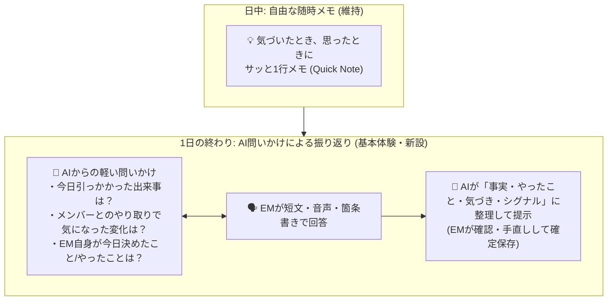

# 第4期ピボット計画書 (4th Pivot Execution Plan)

作成日: 2026-09-18  
関連文書: `docs/4th_pivot/pivot.md` / `docs/4th_pivot/todo.md`  

---

## 1. ピボットの背景と設計思想

### 1.1 解決する課題
- **入力・整理コストの肥大化**: 日々の出来事や議事録を逐一入力・校正・分類する負担が大きい。
- **情報過多による認知負荷**: AIからのアウトプット・提案・思考ロジック・参照ファクトが大量に並び、EMが確認・判断するだけで疲弊する。
- **システムの主客逆転**: EMの業務を楽にするはずのEmtherが、「Emtherを動かすための業務」を生み出している。
- **機微情報リスク**: 1on1記録や組織の機微情報が生データのまま外部AIやストレージに蓄積される懸念。

### 1.2 コア・コンセプト
> **EMは「記録する人」ではなく「考え、判断する人」。**  
> **AIは「答えを出す人」ではなく「思い出させ、整理し、注意を向ける人」。**  
> 設計思想：**「入力を減らす」「見るものを減らす」「必要な情報だけを残す」**

---

## 2. Journal（ジャーナル）の新たな位置づけと入力設計

ユーザーフィードバックに基づき、**「随時メモの手軽さ」を維持しながら、「1日の終わりのAI対話振り返り」を基本体験（メイン導線）へと刷新**する。

1. **基本体験（Primary Flow）: 1日の終わりの「AI対話リフレクション」**
   - EMに「今日一日何があったかを網羅して書く」ことを求めない。
   - AIが「今日引っかかった出来事はあった？」「あの件はどう進んだ？」と適度な問いを投げかける。
   - EMがそれに答えるだけで、今日あったこと・やったこと・感情や気づきが引き出され、構造化された振り返りログとして記録される。
2. **サブ体験（Secondary Flow）: 「思ったとき、気づいたときの随時メモ」の存続**
   - 会議直後やふとした瞬間に忘れないようサッと残せる手軽さは重要。
   - 単発のクイック入力（Quick Journal）は廃止せず、いつでも使えるように残す。
   - 日中に残したクイックメモは、1日の終わりのAI振り返り時に「今日これメモしてたけど、その後どうだった？」と参照・統合される。

---

## 3. `todo.md` 各項目の位置づけとアジャスト方針

| 項目 | 優先度 | pivot.md 方針 | 計画における扱いとアジャスト |
|---|---|---|---|
| **議事録等のローカルLLM要約＆手直し登録** | 中 | 方針1 & 方針4 | **採用（Phase 2）**: 機微な生ログを直接Emtherに溜めず、ローカルLLMでシグナル・要約に抽出した上で手直し登録する。Journal（EMの内省）とは分離したインポーターとして設計。 |
| **テーマ機能の見直し（EM主導＆壁打ち作成）** | 中 | 基本コンセプト & 方針2 | **採用（Phase 3）**: AI自律生成中心を改め、EM自身が「今向き合うテーマ」を定義し、AIは相談で壁打ち相手となって整理・紐付けを支援する。 |
| **「結論」セクションの見せ方・サイズ改善** | 中 | 方針2 & 方針3 | **採用（Phase 1）**: 結論ファースト化。文字サイズ・レイアウトを強調し、思考過程（ファクト・ロジック・代替案・Expand/Challenge）は初期折りたたみ（段階的開示）にする。 |
| **提案済み候補の再追加防止** | 中 | 方針2 | **採用（Phase 1）**: 相談からの提案化で、一度追加したものは「提案済み」バッジを付与し、重複追加を非活性化。 |
| **社内用語・辞書登録** | 中 | 方針2 | **採用（Phase 3）**: 組織略語・用語を登録し、AIの誤読や確認修正コストを低減。 |
| **「提案の詳細」の2段組改善** | 低 | 方針3 | **採用（Phase 1）**: 「判断・提案」と「壁打ち」の並びを整理し、縦長スクロールと認知負荷を軽減。 |
| **エージェント状態・直近の動きの可視化** | 低 | 方針3（衝突注意） | **アジャスト採用（Phase 4）**: 思考プロセスは見せず、「巡回中 / 待機中 / 最終巡回: 15:00（異常なし）」という1行の安心感シグナルに限定。 |
| **更新されたものへの「New」表示** | 低 | 方針2 | **採用（Phase 4）**: 変更箇所を探すコストを削減。 |
| **相談タブのツールチップ範囲不具合** | 低 | バグ修正 | **即時対応（Phase 1）**: `subTabs` の判定範囲不具合を修正。 |
| **Codex / OpenCode サポート** | 後で | 拡張 | **将来スコープ**。 |

---

## 4. フェーズ別ロードマップ

### Phase 1: 「見るものを減らす」UI/UXの即時ノイズカット
- **1-1. 結論ファースト ＆ 思考プロセスの段階的開示（Progressive Disclosure）**
  - `ProposalBlock` / `ConsultReviewPanel`: 結論を主役に据え、ファクト・ロジック・Expand/Challenge・棄却案は初期折りたたみ化。
- **1-2. 提案済み候補の重複追加防止**
  - 相談結果からの提案化UIで、提案済み項目を再追加できないように非活性化＋バッジ表示。
- **1-3. UIレイアウト調整 ＆ ツールチップ判定修正**
  - 提案詳細画面の2段組スクロール改善。
  - 相談サブタブのツールチップ判定範囲の修正。

### Phase 2: 「入力を減らし、機微情報を守る」データインテーク刷新
- **2-1. 1日の終わりの「AI対話リフレクション（振り返り）」機能の実装**
  - AIからの問いかけで1日の思考・出来事・気づきを引き出すUI。
  - 既存の「随時クイックメモ」とシームレスに連携。
- **2-2. ローカルLLMによる議事録等の要約・シグナル抽出インポーター**
  - 長文生ログからローカルで重要シグナルを抽出し、EMが手直しして登録する機能。
  - 機微生データを外部AI・ストレージに蓄積しない安全な取り込み。

### Phase 3: 「EMが考え、判断する」テーマ＆辞書の再構築
- **3-1. テーマ機能のEM主導化 ＋ 壁打ち言語化支援**
  - EM自身が注力テーマを設定し、`/chat` で壁打ちしながら精緻化・Journal/提案紐付けを行うフロー。
- **3-2. 社内用語・コンテキスト辞書（Glossary）の実装**
  - 組織固有の言葉を定義し、要約・相談時のプロンプトに注入。

### Phase 4: 「安心と最小限のシグナル」仕上げ
- **4-1. エージェントのミニマル・ステータス表示**
  - 思考ログは出さず、巡回・待機の健全性のみを1行バッジで表示。
- **4-2. 変更検知「New」バッジの導入**
