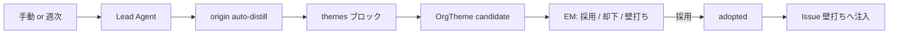

# 組織状況の蒸留（Knowledge Distillation）

作成日: 2026-09-10  
関連: `docs/improvement_v1.md`（H/L/N） / `docs/agent_specialization.md` / `web/src/lib/theme-store.ts` / `web/src/lib/related-context.ts` / `web/src/lib/agent-runtime.ts`

## 0. 目的

EM の本領である次の問いに、AI チームが材料を出し、人間が採用・訂正する。

- これまでの課題・状況を**統括してどう解釈すべきか**
- **より根本の課題**は何か
- それを**どう解決するか**（方向性）

Journal 自動分析や Issue 壁打ちは「個別の類似度検索」だけでは足りない。  
**明示的な蒸留成果物（テーマ解釈）**を持ち、採用済みのものだけを壁打ち前提に注入する。  
あわせて Issue / Journal の**関連束**（ベクトル類似＋繰り返しカウント）を個別判断の材料にする。

## 1. スコープ（本実装）

優先順の **3 → 4 → 1 → 2** を実装する。

| # | 内容 | 本実装 |
|---|---|---|
| 3 | テーマ解釈候補の生成（手動＋週次）と EM 採用 UI | する |
| 4 | Issue 壁打ちへ採用済みテーマを注入 | する |
| 1 | Issue embedding・関連束 | する |
| 2 | Journal 自動分析への関連束・繰り返しカウント | する |

追加要件:

- Settings で自動蒸留の ON/OFF とタイミング（曜日・時刻）を設定可能
- 蒸留結果を壁打ち・提案採用で品質向上・誤り訂正できる入口
- 「なぜこの結果に至ったか」（根拠・判断ロジック）を表示

## 2. データモデル

`OrgTheme`（`theme-store.ts` / `themes.json`）:

- `title` / `summary`（根本課題の見立て）
- `rationale`（なぜこの解釈か＝説明の正本）
- `facts[]`（参照した観測）
- `rootCause` / `suggestedDirection`（任意）
- `evidenceJournalIds` / `evidenceIssueIds`
- `status`: `candidate` | `adopted` | `dismissed`
- `sourceRunId`（生成した Agent Run）
- `embedding`（ローカル、横断検索用）
- `supersedes`（訂正時の版チェーン）

`Issue.embedding`（`issue-store.ts`）: title + Why/What/How（＋タグ）のローカル埋め込み。起票・charter/タイトル更新時に再計算（`updatedAt` は変えない）。API 応答には載せない。

fact は消さない。蒸留結果は interpretation 相当として版管理する。

## 3. 生成フロー

- **手動**: Dashboard「状況を蒸留する」→ `POST /api/themes/distill`
- **週次**: Settings `autoDistillationEnabled` + `autoDistillationWeekday` + `autoDistillationHour`。watchdog が ISO 週キーで二重起動を防ぐ
- 既定は **OFF**（コスト opt-in。朝サマリーと同じ思想）

タスク本文は短い定型（`DISTILLATION_TASK`）のみ。Journal / Issue / 採用テーマの材料は `buildDistillationContextBlock()` でシステムプロンプトへ注入する（巨大な task を `run.task` に載せると `/api/agents` 全件取得が重くなり、相談タブに履歴が出ない原因になる）。

## 4. Human-in-the-Loop

| 操作 | 意味 |
|---|---|
| 採用 | `candidate` → `adopted`。Issue 壁打ちの前提になる |
| 却下 | `dismissed`。Inbox からも外す（run triage 連動可） |
| 壁打ち | 同一 Run で `decideRun`。訂正後に再抽出・再採用 |
| 編集 | 採用済みテーマの文言・rationale を直接更新（`supersedes`） |

「なぜこの結果か」は Run の `proposal.facts` / `logic` と、テーマの `rationale` / `facts` の両方で見せる。

## 5. Issue 壁打ちへの注入（4）

`buildThemesContextBlock()` が **adopted** テーマのみをシステムプロンプトへ載せる。  
候補・却下は載せない（EM 未承認の見立てで推論を汚さない）。

## 6. 関連束（1・2）

`related-context.ts` / `buildRelatedContextForRun()`:

| 場面 | クエリ | 注入内容 |
|---|---|---|
| Issue 紐づき Run（壁打ち・更新分析など） | Issue の title+charter | 類似の未完了 Issue・Journal |
| `origin=auto-anomaly`（Journal 自動分析） | 対象 Journal 本文 | 同上 ＋ **繰り返しシグナル**（TTL 内の類似 Journal 件数） |

- 類似度閾値は `RELATED_SIMILARITY_THRESHOLD`（0.4）
- 材料はシステムプロンプトへ注入（`run.task` には載せない）
- 2 件以上の繰り返しで「構造課題・既存 Issue の続き」を優先検討するよう指示

## 7. 後続

- 採用テーマを Journal 分析の「構造課題 vs 単発」判断材料にする（テーマ注入の拡張）
- sqlite-vec 等によるスケール改善
